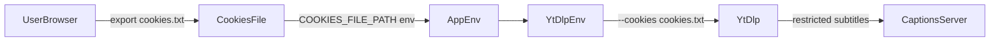

## Cookies guide (`cookies.txt`)

Some YouTube videos require authentication (sign-in), age verification, or are restricted
to certain regions. In these cases, `yt-dlp` may not be able to fetch subtitles without
authenticated cookies, and the API can return errors such as:

- `404 Subtitles not found`

To solve this, you can provide a `cookies.txt` file in **Netscape cookie format** and
configure the application to pass it to `yt-dlp`.

This guide explains:

- why cookies are needed
- how to generate a `cookies.txt` file
- how to plug it into Docker, docker-compose, and local Node.js setups
- how to use the provided `cookies.example.txt` as a safe starting point

---

## Why cookies matter

YouTube may require a logged-in session for:

- age-restricted videos
- “sign in to confirm your age” content
- region-locked content (depending on your location)

`yt-dlp` supports passing browser cookies via a file in Netscape format.
This project reads the `COOKIES_FILE_PATH` environment variable and, if set,
adds the following flags to `yt-dlp`:

```text
--cookies <path/to/cookies.txt>
```

The exact wiring happens in `src/youtube.ts` (see `getYtDlpEnv` and `appendYtDlpEnvArgs`).

If `COOKIES_FILE_PATH` is not set, `yt-dlp` runs without cookies, which is fine for
most public videos but will fail for restricted ones.

---

## Security and git hygiene

Real cookies are **sensitive credentials**. Treat your `cookies.txt` like a password:

- Do **not** commit it to git.
- Keep it outside of public folders and shared volumes when possible.
- Rotate it periodically (e.g. regenerate if you change your password or suspect compromise).

This repository already ignores `cookies.txt` via `.gitignore`, but you should still:

- avoid renaming it to something that is tracked
- avoid copying it into example files that are committed

`cookies.example.txt` in the repo root is a **safe example only** and contains no real data.

---

## How to obtain `cookies.txt`

### Option 1: via `yt-dlp` (recommended for CLI users)

If you already have `yt-dlp` installed, you can export cookies directly from your browser.
Example for Google Chrome:

```bash
yt-dlp --cookies-from-browser chrome --cookies cookies.txt https://www.youtube.com/watch?v=dQw4w9WgXcQ
```

Explanation:

- `--cookies-from-browser chrome` – load cookies from your local Chrome profile
- `--cookies cookies.txt` – save them to `cookies.txt` in Netscape format
- the YouTube URL can be any valid video; it is mainly used to initialize the session

You can substitute `chrome` with other supported browser names according to `yt-dlp`
documentation (e.g. `firefox`, `edge`), depending on your platform.

### Option 2: via browser extension

If you prefer a GUI-based approach, you can use a “cookies.txt exporter” browser extension.
The exact names and steps may vary, but the general flow is:

1. Install a “Export cookies.txt” style extension in your browser.
2. Open `https://www.youtube.com` and sign in with the account you want to use.
3. Use the extension to export cookies for `youtube.com` in **Netscape format**.
4. Save the exported file as `cookies.txt` somewhere on your machine.

Make sure the exported file uses the Netscape cookies format,
which is what `yt-dlp` expects.

---

## Using `cookies.txt` with Docker

### Direct `docker run`

Assuming you have a `cookies.txt` file on your host at `/path/to/cookies.txt`,
you can mount it into the container and set `COOKIES_FILE_PATH`:

```bash
docker run -p 3000:3000 \
  -e COOKIES_FILE_PATH=/cookies/cookies.txt \
  -v /path/to/cookies.txt:/cookies/cookies.txt:ro \
  transcriptor-mcp-api
```

Key points:

- The file is mounted read-only (`:ro`) into `/cookies/cookies.txt` inside the container.
- `COOKIES_FILE_PATH` is set to that internal path `/cookies/cookies.txt`.

### Docker Compose

The repository provides `docker-compose.example.yml`, which already includes a cookie volume:

```yaml
environment:
  COOKIES_FILE_PATH: "/cookies.txt"
volumes:
  - "./cookies.txt:/cookies.txt"
```

This means:

- `cookies.txt` in the same directory as your `docker-compose.yml` will be mounted
  into the container at `/cookies.txt`.
- `COOKIES_FILE_PATH` points to `/cookies.txt` inside the container.

Usage:

```bash
cp docker-compose.example.yml docker-compose.yml
# copy or create cookies.txt next to docker-compose.yml
docker compose up -d transcriptor-mcp-api
```

---

## Using `cookies.txt` with local Node.js

You can configure cookies via environment variables or an `.env` file.

1. Create an `.env` file from the example:

   ```bash
   cp .env.example .env
   ```

2. Edit `.env` and set an absolute path to your cookies file:

   ```dotenv
   COOKIES_FILE_PATH=/absolute/path/to/cookies.txt
   ```

3. Build and run the server:

   ```bash
   npm run build
   # REST API
   npm start

   # or MCP (stdio)
   npm run start:mcp
   ```

The application will read `COOKIES_FILE_PATH` and pass it through to `yt-dlp`.

You can also set `COOKIES_FILE_PATH` directly in the environment, without `.env`:

```bash
COOKIES_FILE_PATH=/absolute/path/to/cookies.txt npm start
```

---

## Using `cookies.example.txt` (safe placeholder)

The repository includes a file named `cookies.example.txt` in the project root.
It is a **synthetic example** in Netscape cookies format and contains no real cookies.

Typical workflow:

1. Copy the example file:

   ```bash
   cp cookies.example.txt cookies.txt
   ```

2. Mount or reference `cookies.txt` as described above:

   - For docker-compose, keep it next to `docker-compose.yml`.
   - For Docker, mount it from the host path where you created it.
   - For local Node.js, point `COOKIES_FILE_PATH` to its absolute path.

3. Verify that the application starts and can read the file.  
   The example entry does **not** give you authentication;
   it only proves the format is valid and the wiring is correct.

4. Replace the example cookie line with your **real exported cookies** following the
   same Netscape format (either by regenerating via `yt-dlp` or a browser exporter).

---

## Data flow overview

The following diagram shows how cookies flow from your browser to `yt-dlp`
through this application:



If any step in this chain is misconfigured (wrong path, wrong format, missing file),
restricted videos may fail to return subtitles. Double-check:

- the file exists and is readable inside the container or process
- `COOKIES_FILE_PATH` matches the **internal** path in that environment
- the file is in Netscape cookies format

